# BPMN — Luồng Phát động Phong trào Thi đua

**Hệ thống:** VPTU Đồng Nai — Thi đua Khen thưởng  
**Phiên bản:** 1.0  
**Ngày:** 2026-04-29  
**Chuẩn:** BPMN 2.0 (mô phỏng bằng Mermaid Flowchart)

> Mở bằng VS Code + extension **Mermaid Preview**, hoặc dán vào [mermaid.live](https://mermaid.live)

---

## Sơ đồ BPMN — Swimlane theo vai trò

```mermaid
flowchart LR
    classDef ldcc   fill:#ddeafc,stroke:#1C5FBE,color:#0b1426
    classDef hd     fill:#f5f3ff,stroke:#7c3aed,color:#0b1426
    classDef lddv   fill:#dcfce7,stroke:#166534,color:#0b1426
    classDef cn     fill:#fef9ec,stroke:#b45309,color:#0b1426
    classDef qtht   fill:#f3f4f6,stroke:#374151,color:#0b1426
    classDef gw     fill:#fef3c7,stroke:#b45309,color:#0b1426,shape:diamond
    classDef gwpar  fill:#e0f2fe,stroke:#0e7490,color:#0b1426
    classDef se     fill:#1C5FBE,stroke:#0d3d8a,color:white
    classDef reject fill:#fee2e2,stroke:#c8102e,color:#9f1239

    START(["▶ Bắt đầu"]):::se

    subgraph LANE_LDCC ["👤  LÃNH ĐẠO CẤP CAO"]
        direction TB
        B1["B1\nSoạn thảo\nphong trào"]:::ldcc
        B2["B2\nTrình\nphê duyệt"]:::ldcc
        B4["B4\nPhê duyệt\nnguồn kinh phí"]:::ldcc
        B5["B5\nBan hành\n& Công bố"]:::ldcc
        B12["B12\nLấy ý kiến\ncông khai\n⏱ ≥ 30 ngày"]:::ldcc
        B14["B14\nTrình ký\nlãnh đạo"]:::ldcc
        B15["B15\nKý số\nCA Token"]:::ldcc
        B16["B16\nCông bố\nkết quả"]:::ldcc
    end

    subgraph LANE_HD ["👥  HỘI ĐỒNG TĐKT"]
        direction TB
        B3["B3\nPhê duyệt\nkế hoạch"]:::hd
        B10["B10\nTiếp nhận\n& Phân loại"]:::hd
        B11["B11\nThẩm định\nnội dung"]:::hd
        B13["B13\nBình xét\nHội đồng\n📊 ≥ 2/3 phiếu"]:::hd
    end

    subgraph LANE_LDDV ["🏢  LÃNH ĐẠO ĐƠN VỊ"]
        direction TB
        B6["B6\nĐăng ký\nđơn vị"]:::lddv
        B9["B9\nDuyệt hồ sơ\ncơ sở"]:::lddv
    end

    subgraph LANE_CN ["👤  CÁ NHÂN / TẬP THỂ"]
        direction TB
        B7["B7\nĐăng ký\ncá nhân"]:::cn
        B8["B8\nNộp\nhồ sơ"]:::cn
        B17["B17\nNhận\nkết quả"]:::cn
    end

    subgraph LANE_QTHT ["🔧  QUẢN TRỊ HỆ THỐNG"]
        direction TB
        B18["B18\nLưu trữ\nhồ sơ\n📁 20 năm"]:::qtht
    end

    END(["⏹ Kết thúc"]):::se
    RUT(["✕ Rút hồ sơ"]):::reject

    %% Gateways
    GW1{ }:::gw
    GW_FORK{{ }}:::gwpar
    GW_JOIN{{ }}:::gwpar
    GW2{ }:::gw
    GW3{ }:::gw
    GW4{ }:::gw
    GW5{ }:::gw
    GW6{ }:::gw

    %% ── FLOW ──────────────────────────────────────────────────────────
    START --> B1 --> B2 --> B3 --> GW1

    GW1 -->|"✗ Yêu cầu\nchỉnh sửa"| B1
    GW1 -->|"✓ Duyệt"| B4 --> B5 --> GW_FORK

    GW_FORK -->|"Luồng\nđơn vị"| B6
    GW_FORK -->|"Luồng\ncá nhân"| B7 --> B8

    B6  --> GW_JOIN
    B8  --> GW_JOIN
    GW_JOIN --> B9 --> GW2

    GW2 -->|"✗ Trả lại"| B8
    GW2 -->|"✓ Đạt"| B10 --> GW3

    GW3 -->|"✗ Thiếu\nĐK hình thức"| B9
    GW3 -->|"✓ Đủ"| B11 --> GW4

    GW4 -->|"✗ Không\nđủ tiêu chí"| B9
    GW4 -->|"✓ Đủ"| B12 --> GW5

    GW5 -->|"✗ Có phản\nánh hợp lệ"| B11
    GW5 -->|"✓ Không\nphản ánh"| B13 --> GW6

    GW6 -->|"✗ Không đủ\n2/3 phiếu"| RUT
    GW6 -->|"✓ Đủ phiếu"| B14 --> B15 --> B16 --> B17 --> B18 --> END
```

---

## Chú giải ký hiệu

| Ký hiệu | Loại | Mô tả |
|---|---|---|
| `(["▶ ..."])` | Start Event | Sự kiện bắt đầu luồng |
| `["..."]` | Task | Nhiệm vụ / hoạt động |
| `{ }` | Exclusive Gateway (XOR) | Rẽ nhánh độc quyền — chỉ đi một nhánh |
| `{{ }}` | Parallel Gateway (AND) | Song song — đi tất cả nhánh cùng lúc / hội tụ |
| `(["✕ ..."])` | End Event (Error) | Kết thúc nhánh từ chối |
| `(["⏹ ..."])` | End Event | Kết thúc luồng chính |

---

## Màu sắc theo vai trò

| Màu | Vai trò |
|---|---|
| 🔵 Xanh dương nhạt | Lãnh đạo cấp cao (LĐCC) |
| 🟣 Tím nhạt | Hội đồng TĐKT (HĐ) |
| 🟢 Xanh lá nhạt | Lãnh đạo đơn vị (LĐDV) |
| 🟡 Vàng nhạt | Cá nhân / Tập thể (CN) |
| ⚫ Xám nhạt | Quản trị hệ thống (QTHT) |

---

## Thống kê luồng

| Thuộc tính | Giá trị |
|---|---|
| Tổng số Task | 18 |
| Exclusive Gateway (XOR) | 6 |
| Parallel Gateway (AND) | 2 (1 fork + 1 join) |
| Nhánh từ chối / trả về | 6 |
| Nhánh kết thúc sớm | 1 (Rút hồ sơ) |
| Bước có ràng buộc thời gian | 1 (B12 — ≥ 30 ngày) |
| Bước có ngưỡng số học | 1 (B13 — ≥ 2/3 phiếu) |
